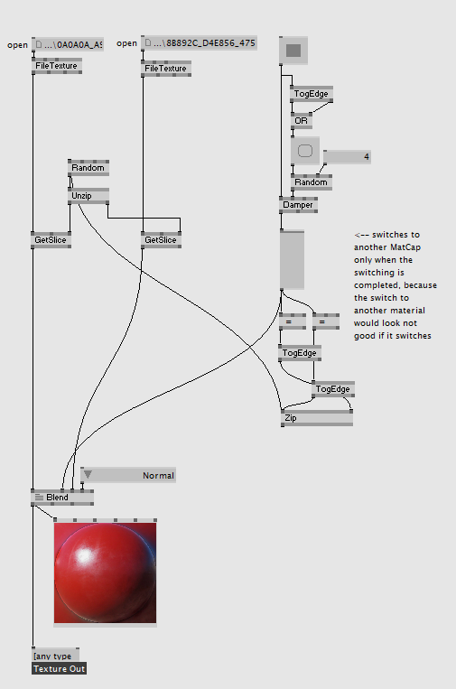
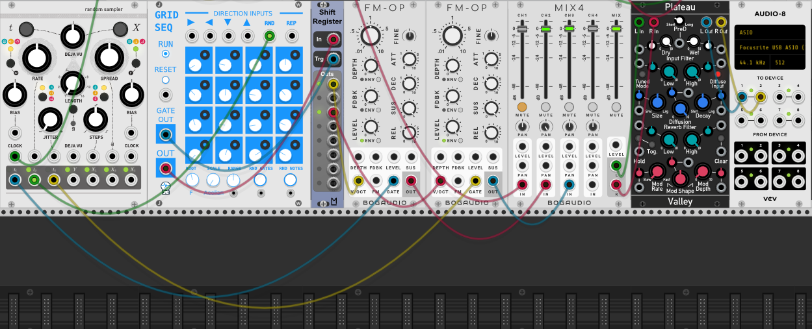
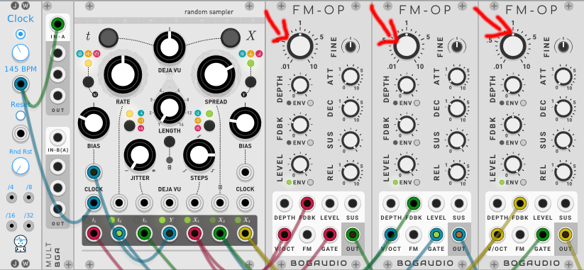
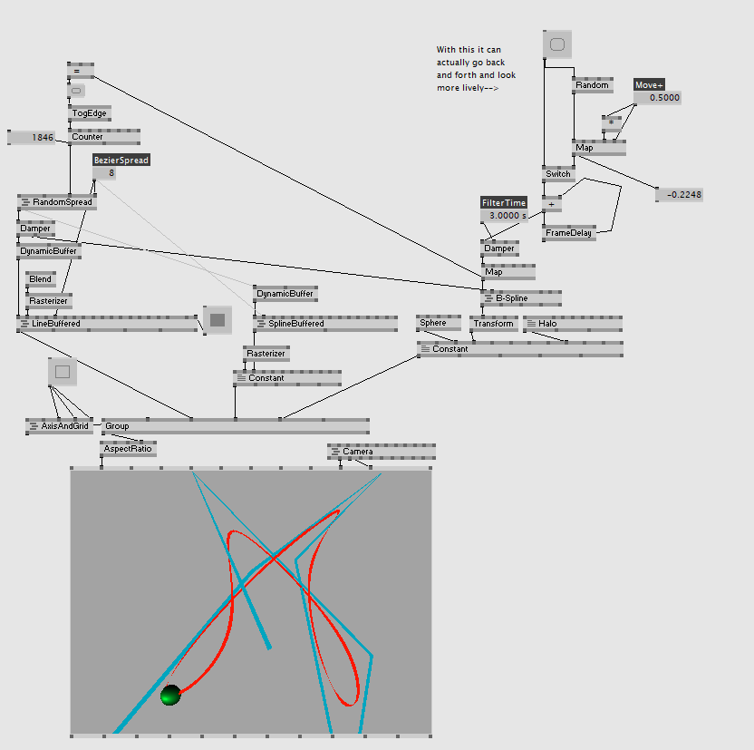

# Transcending Oil Painting In Void

## work done while christmas time
* established contact with Jan Schou -> he is one of the technicians in alte Münze
* he was willing to foward my project description to the head of alte Münze
* i wrote a writing to the alte Münze in Berlin to ask if there would be the possibility to exhibit in there

## 05.01
* got the Orbbec depthcam working in vvvv
* the Orbbec only works with particles that are generated in 3d space
* it is not possible to distinguish between multiple persons that way
* maybe that can be solved by looking into the z and x-axis and to maybe separate persons from each other by looking at particles that are at a certain distance from each other and to get it working that way
* found out about the possibility of using Matcaps together with raymarching
* built a MatcapShifter to be able to switch between multiple materials with a blend node and with a mechanic so that the switching is very adjustable and fluent.

* learned about the tidal modulator 2 in VCV-Rack because I think I can use it as a very good envelopegenerator to feed sound in a granular reverb
* learned about Mutable Instruments Marbles in VCV which is what I believe suitable to send triggers to the tidal modulator 2 / I like it because it has a jitter function which will be benifitting for the agitated behavior of the Oil Monster
* learned about the grid sequencer and the fm-operators to build a nice musical scenery for entering the installation in the beginning where there is not much movement and everything is fine in the beginning only flow and happiness / This scenery will be built with the randomsampler connected to a grid sequencer, a shift register and two FM-OP

## 06.01
* worked further on the introduction scenery -> by coming near the tuning of the FM-OP could go in random different directions so that there is a feeling of unease in the audio layer because of the detuning

  * The outputs of gates t1 and t3 are mby suitable for the subtle movents of the oil painting when it fills the whole space -> **turn up the jitter** for a more alive fluid feeling
* tutorial about the randomsampler module in vcv
* there have to be different layer in the music like there are within the noise section in the visuals! each section needs to be defined on its own and then maybe postprocessed in a granular thingy or something like that
  * came up with an idea how to connect the language. like there are different layers of noise there should be different layers in the sound of the object. and they should shift together when the mood of the whole painting changes.
* build a first version of the "Mover" that is responsible for a more alive feeling for the oil painting - works with the help of a spline where the Sf3d-sphere then moves on.
* 

## 06.01
>  ### Best Case Scenario
> * the program is optimised in the way that the technical limitations are met that it runs at a steady 60fps -> have to check which methods for distortion aand fractal multiplication are suited best and which kind of noise to use in that case.
> * as of now the oil painting behaves in a very random way. It would be great to achieve a behavior that resambles an lively abstract beeing -> use path that randomise everytime
> * movements would have multiple patterns but they are combineable and differ slightly from each base movement so it looks more alive -> maybe with some kind of flocking behavior??!!
> * It also would be awesome if the oil painting could respond to gestures the participant -> Problem: one has to pay for the option of getting a body skeleton out of the orbbec depthcam - no idea how to capture body gestures
> * different stages of aliveness go fluidly into each other
> * the sounds the painting is making could be interpreted as some kind of abstract language which is in sync with the visual painting -> would make it more immersive  
> * works with multiple participants / as of now there is no distinction between multiple or single usecases
> * changing materials would resemble a change in mood -> increase in metalness = angry     more roughness -> relaxed 
> * materialchanges can be interaktive too
 

> ### Worst Case Scenario
> * the program is not steadily running at 60fps -> framedrops would result in a worse experience 
> * the behavior of the oil painting appears to be random it is not mentioned by the audience that it resembles an alive beeing -> loss of interest in the interaction with the oil painting -> no checking how far one could go with it -> only consume 
> * no clear connection between sound and movement of the painting -> no feeling of connection or communication 
> * stages of excitement have no sexy transition
> * no reading of gestures - no body tracking -> experience suffers
> * materialchanges do not support the mood of the painting and appear to be random
> * no option to be able to interact with the painting with multiple users / only one participant

## 07.01
* watched tutorial about how raymarching works to may be able to better the performmance in the program
* rewrote the program of the raymarcher from scratch and experimented with min and max distances and the iteration count to see if there is any headroom available.
* learned about shaders / watched multiple tutorials decided on another approach to make the material interactive too

## 08.01
* experimented with the flow of the distortion of the SF3D Noise field via a 3DVectorField. Compared normal vectorfields with divergence free vectorfields to see if there could be some kind of saving in performance by using divergence free vectorfields but it turns out that there is not much of a saving with this. Additional I think there is a better visual flow implemented with the normal vectorfield, so I take this one!
* perlin noise is more suitable for generating fluid flow in the painting when it is distorted by the vectorfield then simplex does
* implementing the textureshifter made me realise that the way it is working is not perfect for achieving good results to make a beautiful outcome possible... now have to see wether I can build this with another plugin called superphysical or if i have to stay with the normal MatcapShifter I build earlier...
* decided to enhance the MatcapSwitcher, because working with superphysical needs additional computing power which i dont have
* thinking further about the concept of talking: the distance thats been changed in the position of the sdf's should correlate to the sound. So when there is a bigger change in position that means a filter is opening at a certain amount to improve the aliveness behavior of the painting. Trying to measure the difference to the change in position and then at a certain threshold there is an addition happening to get higher values. below a certain threshold it substracts from the previous added values to go back to the original state.
* Working on how to get an average brightness of the picture to make the sound behave in the way the oil painting is filling the screen space.

define the stages and how many of them shall be available in the worst and best case!

put in the documentation when i wtched tutorials and what  learned!
