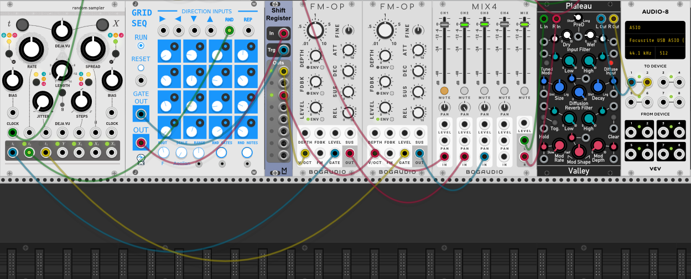

# Transcending Oil Painting In Void

## work done while christmas time
* established contact with Jan Schou -> he is one of the technicians in alte Münze
* he was willing to foward my project description to the head of alte Münze
* i wrote a writing to the alte Münze in Berlin to ask if there would be the possibility to exhibit in there

## 05.01
* got the Orbbec depthcam working in vvvv
* the Orbbec only works with particles that are generated in 3d space
* it is not possible to distinguish between multiple persons that way
* maybe that can be solved by looking into the z and x-axis and to maybe separate persons from each other by looking at particles that are at a certain distance from each other and to get it working that way
* found out about the possibility of using Matcaps together with raymarching
* built a MatcapShifter to be able to switch between multiple materials with a blend node and with a mechanic so that the switching is very adjustable and fluent.

* learned about the tidal modulator 2 in VCV-Rack because I think I can use it as a very good envelopegenerator to feed sound in a granular reverb
* learned about Mutable Instruments Marbles in VCV which is what I believe suitable to send triggers to the tidal modulator 2 / I like it because it has a jitter function which will be benifitting for the agitated behavior of the Oil Monster
* learned about the grid sequencer and the fm-operators to build a nice musical scenery for entering the installation in the beginning where there is not much movement and everything is fine in the beginning only flow and happiness / This scenery will be built with the randomsampler connected to a grid sequencer, a shift register and two FM-OP

## 06.01
* worked further on the introduction scenery -> by coming near the tuning of the FM-OP could go in random different directions so that there is a feeling of unease in the audio layer because of the detuning

  * The outputs of gates t1 and t3 are mby suitable for the subtle movents of the oil painting when it fills the whole space -> **turn up the jitter** for a more alive fluid feeling
* tutorial about the randomsampler module in vcv
* there have to be different layer in the music like there are within the noise section in the visuals! each section needs to be defined on its own and then maybe postprocessed in a granular thingy or something like that
  * came up with an idea how to connect the language. like there are different layers of noise there should be different layers in the sound of the object. and they should shift together when the mood of the whole painting changes.
* build a first version of the "Mover" that is responsible for a more alive feeling for the oil painting - works with the help of a spline where the Sf3d-sphere then moves on.
* 

## 07.01
* watched tutorial about how raymarching works to may be able to better the performmance in the program
* rewrote the program of the raymarcher from scratch and experimented with min and max distances and the iteration count to see if there is any headroom available.
* learned about shaders / watched multiple tutorials decided on another approach to make the material interactive too

## 08.01
* experimented with the flow of the distortion of the SF3D Noise field via a 3DVectorField. Compared normal vectorfields with divergence free vectorfields to see if there could be some kind of saving in performance by using divergence free vectorfields but it turns out that there is not much of a saving with this. Additional I think there is a better visual flow implemented with the normal vectorfield, so I take this one!
* perlin noise is more suitable for generating fluid flow in the painting when it is distorted by the vectorfield then simplex does
* implementing the textureshifter made me realise that the way it is working is not perfect for achieving good results to make a beautiful outcome possible... now have to see wether I can build this with another plugin called superphysical or if i have to stay with the normal MatcapShifter I build earlier...
* decided to enhance the MatcapSwitcher, because working with superphysical needs additional computing power which i dont have
* thinking further about the concept of talking: the distance thats been changed in the position of the sdf's should correlate to the sound. So when there is a bigger change in position that means a filter is opening at a certain amount to improve the aliveness behavior of the painting. Trying to measure the difference to the change in position and then at a certain threshold there is an addition happening to get higher values. below a certain threshold it substracts from the previous added values to go back to the original state.
* Working on how to get an average brightness of the picture to make the sound behave in the way the oil painting is filling the screen space.

## 09.01
* tested graohics card (RTX 2080) and found it to be working 40% to 50% better then my previous gtx 1070
* improvements only in HD, when resolution gets higher then there are still a lot of frame drops occuring
* tested if scalar operations are better suited to improve perfomance further, but found that "combine SDF" works better, but only in visual terms

## 27.01
* meeting at "alte Münze"
* exhibition is possible :)

## 28.01
* testing of the kinect
* skeleton and hands can easily detected - will be easier then with the orbbec
* approach with point cloud not needed anymore -> improvement in performance

## 29.01
* a lot of experimenting with different modules in VCV to see what could be suitable for generating the "language" of the oil painting but a lot of failure
* to be able to produce what is resting as an idea in mind actually need a lot of practice which i dont have

## 01.02
* watched a lot of tutorials on how to make use of granular synthesis  

* found a better way to produce random or more "lively" sounds with this tiny Random module and very good combinational possibilities with this Knobs module 
* SlewLimiter right here is also suitable for "talking" abilities of the oil painting because it slews down random vlaues and glues them more together 
  
* its important for alive behavior to have a lot of modulation going on in the sound to make it seem alive -> lots of experimenting

## 02.02
* researched on what especially the gpu is utilising for the raymarching - my guess would be that it only depends on the clockspeed, nothing cuda or anything like that is displayed by the resopurces monitoring / it only says "3d" / dont know what to do with that, but i think it is only the clockspeed
* improved my skillset with various modules of VCV
* found a good first approach for making a kind of astract talking like language with the combination of these modules - needs further improvement  

## 03.02
* got a second kinect - ran into a problem with the framerate of the kinect - seems to have frame drops other then the kinect from university
* I had to download a more up to date driver of the kinect to get rid of the problem, dont know why the first kinect got the newer driver automatically and the other kinect not...
* Its not as easy as i thought to use two kinects at the same time, now only one works at a time
* researched on using multiple kinect´s and it seems that to make it work every kinect needs to be on different usb-buses. Have to buy something like [this](https://www.amazon.de/SupaGeek-5-Port-PCI-Express-Erweiterungskarte-USB-3-0-Anschluss-erweiterbar-USB-3-0-Ports/dp/B07FK28BXX/ref=asc_df_B07FK28BXX/?tag=googshopde-21&linkCode=df0&hvadid=310638483583&hvpos=&hvnetw=g&hvrand=11282006384930535804&hvpone=&hvptwo=&hvqmt=&hvdev=c&hvdvcmdl=&hvlocint=&hvlocphy=9061132&hvtargid=pla-564023928464&psc=1&th=1&psc=1&tag=&ref=&adgrpid=63367893073&hvpone=&hvptwo=&hvadid=310638483583&hvpos=&hvnetw=g&hvrand=11282006384930535804&hvqmt=&hvdev=c&hvdvcmdl=&hvlocint=&hvlocphy=9061132&hvtargid=pla-564023928464)
* asked in the vvvv forum and was told that its possible to use more then one kinect when installing this [PICE-USBExtensionCard](https://www.amazon.de/StarTech-Com-SuperSpeed-Express-Schnittstellenkarte-Kan%C3%A4len/dp/B00HJZEA2S)
* checked on how to make use of boids and flocking behavior - watched a lot of [tutorials](https://www.youtube.com/watch?v=bqtqltqcQhw) from Sebastian Lague. Found that there is an implementation similar to what Sebastian wrote already existing in vvvv. A plugin called "flocking behavior".
* implemented it the way it would make use for the oil painting / the plan is to have the whole screen space filled and by moving hands to disturb the SDF. This could be done with the flocking behavior as shown in the picture:  

## 04.02
* read about overclocking - not much to gain from that in terms of fps
* implementation of boids behavior with kinect - works with two hands as either enemys or attractor
* implemented interaction with multiple users
* experimented with values to see what would be best suited for alive behavior, but i havent found the right combination until now

## 05.02
* looked into particles and how they could be of use, but the attractor in combination with mass cant give me the behavior I want.
* experimented with buffered geometry and attractors in combination with spreads but there where a lot of bugs, or I am not understanding how to make use of buffered geometry and transformations (but I have been using them as of now with no problems but the implementation together with a damper was having a lot of errors)
* after a lot of time spend finding out why the buffered damper is giving me errors all the time I found out that the time in the buffered damper is normalized from 0 to 1. every value that goes above that threshold is not beeing used in the damper and it stands still - there is nothing to find in the documentation about that and why it was implemented that way...

## 06.02
* worked on implementing velocity values to the quads that are for combining scalar distance fields together with the SDFNoise but I couldnt get it done in the way that every attractor adds its own frame velocity values to the boxes. I couldn make a selection and read the frame differences separately
* found a solution to design a virtual screen with obs and make it fullscreen over there and have it on full-HD all the time
* combined the flocking behavior of the boids with 
* how I intended it to be in the end is maybe too heavvy on the graphics-card... 
* I did a lot of testing and when I use the "combineSDF" (which is essential for the concept to work together with the boids that I wanted to use)

## 12.02
* started again experimenting for the sound of the aggressive behavior of the painting
* getting more familiar with the random sampler, knobs, slewlimiters, random gates, triggers and random slewed behavior
* this is all needed because I want the aggressive oil painting to sound very much alive so I need a lot of modulation and guided randomness to make it sound like a thing that really talks

## 13.02
* build Midi-communication from VCV to vvvv via loop Midi  

* worked further on improving the talkativeness of the oil monster

## 14.02
* established bidirectional communication between vvvv and VCV via loop Midi  

* I need it to be both ways because triggers, gates and velocity values are needed to be send sometimes to vvvv or to VCV
* furher improvements on the oil monster sound  

* the speach of the monster consists of 5 oscillators. 
  * 2x macro oscillator in different modes which are going into the clouds "Neil" to be granular processed there
  * 2x macro oscillator in the same modes as mentioned above but they are going "dry" into the mixer to add some more clarity to the signal
  * 1x VCO with a low basefrequency that receives random pitch information from a combination of different noise generators and attenuverters / send into a VCF that also receives random signals to change the cut off frequency of the filter
  * the first two oscillators are then mixed together with the VCO and send into the clouds granular module
  * then the processed signals are mixed together with the  dry signals 
* I think the sound that the oil monster produces now is going into the direction I was aiming for / very raw and aggressive sound. Ilike it :)

## 01.03
* did a lot of testing today to see if it is possible but in the end it is not really working with this method because of its instability in combination with the tracking of the kinect
* -> when moving the hands at higher speeds there are framedrops which go up to 10 - 40 frames...
* thought about how I still could do it / maybe a solution to do it in 2d which wouldn't be as cool as I intended it to be but then it would be usable and not such a pain in the ass!!!
* started to re-think the concept in 2D.
* some things dont really work as they did in 3d especially the idea of the different emotional stages in combination with "combineSDF"
* converting a texture into an SDF and then using "combineSDF" on another noiseScalarField is not giving me the wanted behavior
* there may be a possibility to do it like I did it in 3d by combining gradient 

## 02.03
* flocking behavior does not put the initial positions of the flock at the right positions / even after the flock is disturbed they do not land at the desired output location

## 03.03
* found that flocking behavior is not suitable at a higher spreadcount -> framedrops do occur again.
* checking out again particles for that
* programed my own attractor particle system, it is fully spreadable and applicable for multi user purposes
* It is build to leave a trail behind like when one would move his hand trough water  
  
* there is the problem that it is very hard on the CPU when the spreadCount is high but it is much more efficient then what I was using with flocking behavior -> but it is not looking so good as the flocking behavior
* found out while testing that only one direction of only one hand is spreadable with queue. -> to make it work i have to programm it onto the gpu and then read it back, that is again shitty for the performance...!!
* again big performance problems when using the Attractor with the grid of particle points as sdfCircles. This drops again the whole performance...
* Maybe it could work the other way around, with the attractors beeing ne negativ multiplied and then undistorting the texture below!
* I was able to build a masking with a circle SDF (what is done by the hands motion) and a clamped mapped circle SDF by scalar multiplying them
* here I have to write a bit about the maskthing
* to make it more painting like I build an additional domainditortion that makes the mask look not only look like movin circles as a mask but more like a woosh trough water and paint (here needs to be the picture of the distorted circles)

## 04.03
* found a better way with morphing between sdf's and the using the masked circles to control the morphing
* I build another noisefunction that lies beneath the surface of the upper noise and then is opened up by the circle SDF mask
* That is the life of the painting that sits below

## 06.03
* started experiments for the generel musical atmosphere in vcv
* tried out different oscillators
* again landed at the FM-OP
* I want a musical appealing atmosphere so I started to layer three different chords over one of each other
* C-Minor then G-Minor and A-Minor / they are having a good relationship to each other because the are related via the 5th
* worked further on the "Monster below the painting" 

## 08.03
* worked further on the atmosphere
* started to implement some motion that should appear to be a bit random but has an overall structure to it
* added the functionality of random gates triggered by the turing machine with random lengths
* I want the atmosphere to behave accordingly to the distance of the visitors too
* first I detune the 6 oscillators in a random way to each other so the mood changes at first in a weird manner
* the next overall emotional stage is implemented by strengthening the FM by depth and feedback (maybe I measure the overall distance of everybody and then change the )
* I need this 

# 09.03
* started to begin with the sqishy sounds for the interactive beahvior with the hand movement
* I wanted it to be like when one would move through the er with the hands / some kind of bubbly sound
* So when moving the hands you are somewhat going through the paint of the oil painting and unveil whats beneath it, the living thing -> the soul of the painting
* researched on how to build water / bubbly sounds in VCV and didnt find much
* watched a tutorial on using the VST-Helm-Synthesizer / thought I could build it the same way in vcv -> crossmodulation in VCV was too hard for me -> couldnt find a way to build it the same way
* experimented
* I tried to build some water drops with an lfo that is going through   
* the good thing is that it is possible to use polyphonic cables the way I build it, the bad thing is that it sounds shitty
* by going through the presets of the macro Oscillator 2 I found a preset thats very much sounding like a wave - the bad thing is that it is not polyphonic so I have to use a lot of instances, at that may be a problem when there are a lot of peoples using these synthesizers at once   
  

## 10.03
* started to connect the sounds and the animations
* had to write a remapping to adapt the velocity values of the hands to a better hearing curve / meaning that when there is slow but steady movement in the hands the volume of the bubble sound is to low to hear it and in the end gets to fast too loud - to counter this is wrote this remapping of the values  

* because the pitch should also be affected by the velocity values and they should move up in another way then the remapped values I decided to handle them separate.
* also because pitch values are going up to fast, I implemented a slew limiter with a slow rising time and a fast decline / I wanted the pitch to move up very slowly / this is only possible by containing a high frame velocity (fast moving hands over a longer period of time) / this leads to a suttle change in the behavior when one is interacting with the painting -> so the painting kind of reacts to what the input is over time  
 
* the monster needs to appear when a certain rule is fulfilled
  * that rule is when there are too many people moving their hands too much -> then the painting gets angry and expresses that 
  * this is visually done by showing of the layer that is beneath the surface of the normal oil painting -> looks harsher, has a lot of more sharp edges and a different color
  * the method to see if there is too much movement by the visitors is achieved by measuring the overall brightness of the masking texture   
  * the switching mechanism is triggered by a short bang that is met at a certain threshold of the measuring of the overall brightness of the masking texture
  * it makes the sdf circles bigger according to the amount of the modulation of certain parameters of the monster sound in VCV
  * additionally some values that are modulating the sound of the monster in VCV that make it seem more alive also trigger the distortion of the noise field that lies beneath the painting -> this glues the visual and the audio behavior of the monster more together
* analyzing the whole texture to measure the brightness is way to heavvy on the gpu... -> choose to take the framevelocity of the hands movement divided by the amount of the people interacting with the installation to trigger the monster at a certain threshold
* makes more sense because in the end it make no real difference to either see how bright the overall texture is or how fast hands are moving because they correspond to each other very much